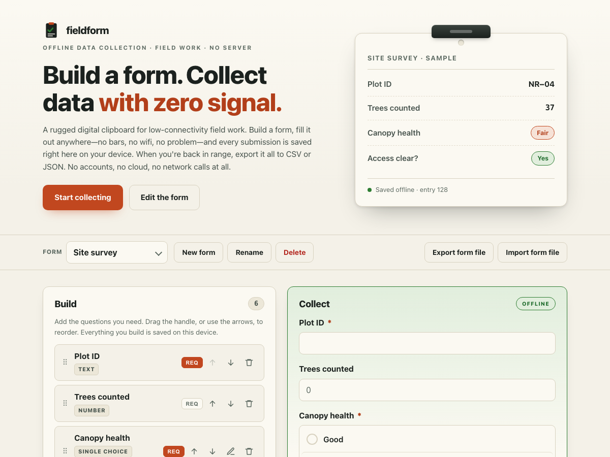

# fieldform

**Build a form. Collect data with zero signal.** An offline-first form builder and data-collection tool for low-connectivity field work. Build a form, fill it out anywhere — no bars, no wifi, no problem — save every submission on your device, then export it all to CSV or JSON when you're back in range. 100% client-side, zero dependencies, works fully offline.

## Why

Field work rarely happens where the signal is good. You're in a forest plot, a basement, a remote village, a warehouse aisle — collecting the same handful of answers over and over — and the app you're using either needs a live connection, an account, and your location, or it's a paper form you'll re-type later and get wrong.

fieldform is deliberately small and private. **Build** a form from plain field types — text, number, single-choice, multiple-choice, date, and yes/no — mark what's required, and reorder as you go. Then **collect**: fill it in, hit save, and each entry is stored right here on the device with a running count. Browse and delete entries, and when you're done, **export** everything to CSV (opens straight in Excel or Sheets) or JSON. You can even export the form definition itself as a small JSON file and hand it to a colleague — they import the file and start collecting with the exact same form. No backend involved.

## Features

- **Two clear modes** — **Build** the form, then **Collect** submissions against it. Switch freely; edits to the form apply to new entries.
- **Six field types** — text, number, single-choice, multiple-choice, date, and yes/no. Mark any field **required**.
- **Reorder and edit inline** — drag the handle (or use the up/down arrows) to reorder, rename a field by clicking its label, and edit choices in place.
- **Collect fully offline** — every saved entry lives in this browser's local storage, with a running count. Browse and delete individual submissions.
- **Required-field validation** — an incomplete entry is blocked, with the missing fields marked; number fields are checked for valid numbers.
- **Export submissions** — one click to **CSV** (RFC 4180-escaped, with a UTF-8 BOM so Excel reads it cleanly) or **JSON** (form definition plus every answer).
- **Share the form as a file** — **Export form** downloads the definition as JSON; **Import form** rebuilds it exactly on another device. The handoff is a file, so it needs no shared server.
- **Multiple forms** — keep separate forms for different surveys, each with its own submissions.
- **100% offline** — no accounts, no network calls, no tracking. Everything is saved only in this browser's local storage.

## Quickstart

Just open `index.html` in any modern browser — no build step, no server, no install.

- **Local:** double-click `index.html`, or run a static server in the folder.
- **Hosted:** **[Open fieldform live](https://sreenivas-sadhu-prabhakara.github.io/fieldform/)**

To use it in the field, open it once while you have signal, then add it to your home screen ("Add to Home Screen"). Because fieldform makes **no network calls at all**, it keeps working with no connection — it isn't precached by a service worker (that would need the network); it simply has nothing to fetch. Your forms and submissions are saved in your browser's local storage, so they persist between visits on the same device.

## Privacy

- A strict Content-Security-Policy sets `connect-src 'none'`: the app **cannot** make any network request, even if it tried. That single rule is the whole privacy guarantee.
- No external fonts, scripts, images, or analytics. Everything is self-contained in a handful of files.
- All logic runs in your browser. Nothing you build or collect is ever transmitted or stored anywhere but your own device.
- Because there are no network dependencies, it keeps working offline — load it once and it runs with no connection at all.

## A note on "offline-first"

Being honest about what that means here: **there is no server and no cloud sync.** Real sync would need a backend, and fieldform deliberately does not have one. It works with zero signal because it is a single static page that never makes a network request — not because it quietly syncs later. The way you move data off a device is to **export** it (submissions to CSV/JSON, the form to a JSON file), not to sync it. Your submissions live only in the browser that collected them; **keep your exports as your backup**, and remember that clearing your browser data will delete anything you haven't exported.

## Disclaimer

fieldform is a convenience tool for collecting your own data offline. It is **not** a certified, validated, or compliant data-management system, it is **not** a substitute for a backed-up database or a professional data pipeline, and it makes no guarantee that data will be retained — browser storage can be cleared by the browser, the operating system, or you. This software is provided under the MIT License, "as is", without warranty of any kind; the authors accept no liability for any lost, corrupted, or mishandled data, or for any decision made on the basis of data collected with it. **Export early and often, and keep your own backups.**

## License

[MIT](./LICENSE) © 2026 Sreenivas Sadhu Prabhakara
